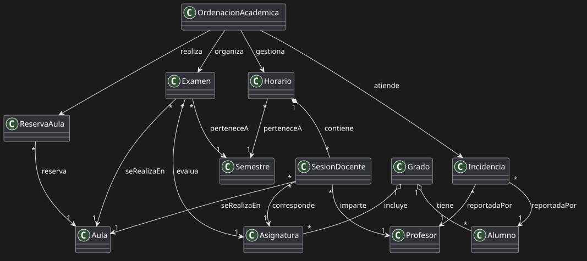
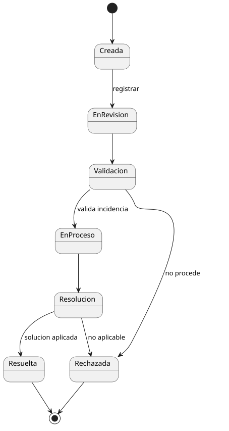
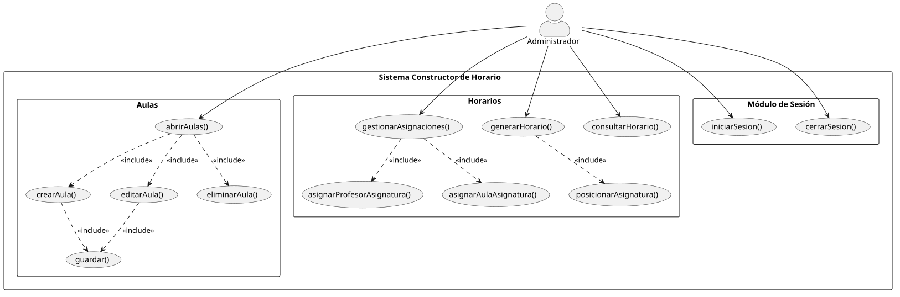
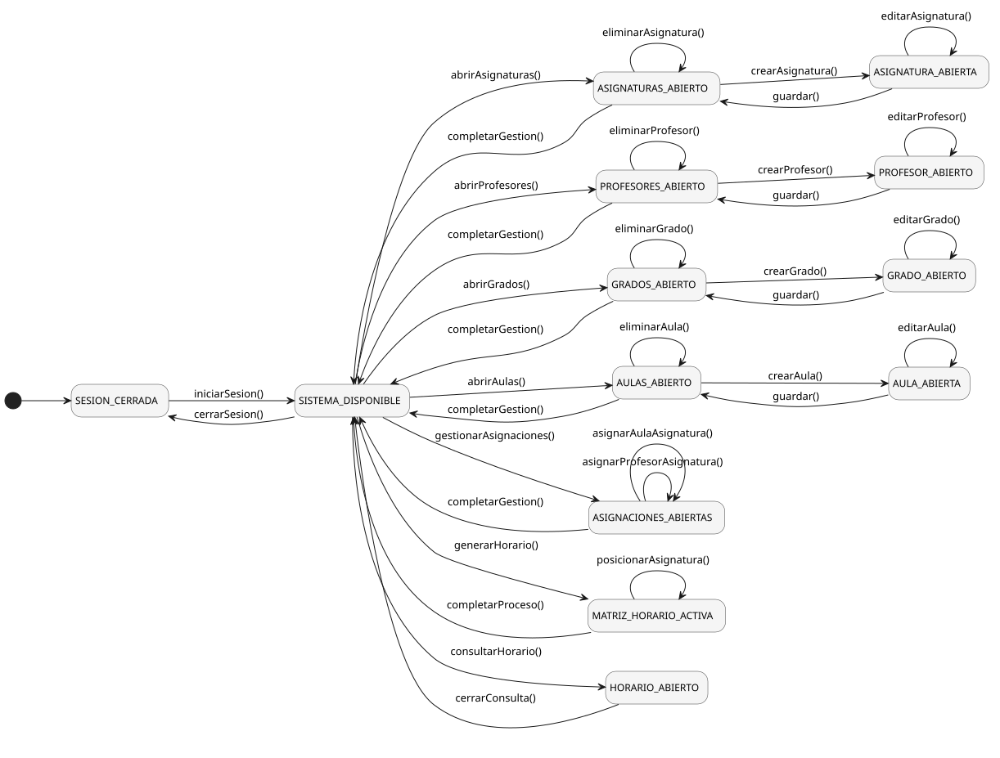

# Capítulo 2 – Análisis del Sistema y Modelado del Dominio

## 1. Introducción

El presente capítulo tiene como objetivo definir y acotar el sistema objeto de desarrollo mediante una abstracción del dominio académico. Para ello, se identifican los conceptos principales del sistema de construcción de horarios, así como sus relaciones, comportamientos dinámicos y funcionalidades.

Este análisis permite establecer una base sólida para el diseño e implementación del sistema, garantizando la coherencia entre los requisitos funcionales y la realidad del dominio.

---

## 2. Modelo del Dominio

El modelo del dominio representa los conceptos fundamentales del sistema y las relaciones existentes entre ellos. En este caso, el sistema está centrado en la **gestión y construcción de horarios académicos**, incluyendo la asignación de recursos y la detección de conflictos.

### Elementos principales

El dominio se estructura en tres grandes bloques:

- **Horarios**
  - Horario
  - Sesión docente
  - Asignatura
  - Grado
  - Semestre

- **Incidencias**
  - Alumno
  - Profesor
  - Incidencia

- **Reservas**
  - Reserva de aula
  - Examen
  - Aula

### Relaciones principales

- Un horario contiene múltiples sesiones docentes.
- Cada sesión docente está asociada a una asignatura, un profesor y un aula.
- Un grado agrupa asignaturas y alumnos.
- Las incidencias pueden ser reportadas por alumnos o profesores.
- Las reservas y exámenes están vinculados a aulas concretas.

Este modelo permite representar la estructura conceptual del sistema antes de su implementación.

---

## 3. Diagrama de Objetos

El diagrama de objetos representa una **instancia concreta del sistema en un momento determinado**, mostrando ejemplos reales de los elementos definidos en el modelo del dominio.

A diferencia del modelo del dominio, que es abstracto, este diagrama permite visualizar un escenario específico del sistema, como por ejemplo:

- Un horario concreto de un grado en un semestre determinado.
- Sesiones docentes asignadas a una asignatura real.
- Profesores, alumnos y aulas con identificadores específicos.

### Finalidad

El objetivo del diagrama de objetos es:

- Validar la coherencia del modelo del dominio.
- Representar un estado real del sistema.
- Detectar posibles conflictos de planificación en un escenario concreto.

---

## 4. Diagrama de Estados

Los diagramas de estados modelan el **ciclo de vida de las entidades más relevantes del sistema**, representando cómo evolucionan a lo largo del tiempo en función de eventos y decisiones.

En este sistema se han modelado tres entidades principales: horario, incidencias y reservas de aula.

---

### Estado del Horario

El horario representa el núcleo del sistema y pasa por distintas fases:

- **Borrador:** estado inicial de creación.
- **En construcción:** se están añadiendo y modificando sesiones.
- **Validado:** el sistema ha comprobado que no existen conflictos.
- **Publicado:** el horario está disponible para su consulta.
- **Archivado:** el periodo académico ha finalizado.

El flujo incluye decisiones mediante nodos `<<choice>>`, especialmente en la validación de conflictos y en la publicación del horario.

---

### Estado de las Incidencias

Las incidencias siguen un ciclo de vida orientado a su gestión y resolución:

- **Creada**
- **En revisión**
- **En proceso**
- **Resuelta**
- **Rechazada**
- **Cerrada**

El sistema evalúa su validez y determina si pueden ser resueltas o deben ser descartadas.

---

### Estado de las Reservas

Las reservas de aula gestionan la disponibilidad de recursos físicos:

- **Solicitada**
- **Pendiente de aprobación**
- **Aprobada**
- **Rechazada**
- **Finalizada**
- **Cancelada**

Este flujo permite controlar la asignación de aulas evitando conflictos de ocupación.

---

## 5. Casos de Uso

Los casos de uso describen las funcionalidades que el sistema ofrece desde el punto de vista del usuario, modelando el comportamiento del sistema ante los estímulos del entorno. En esta sección se formalizan los actores implicados, los diagramas estructurados y las responsabilidades detalladas de cada operación del sistema.

### Actor Principal

De acuerdo con el alcance definido, el sistema interactúa de forma centralizada con un único rol operativo:

- **Administrador:** Actor principal que posee el control total sobre la plataforma. Es el responsable de la gestión de los registros base (Asignaturas, Profesores, Grados y Aulas), de realizar las asignaciones cruzadas de recursos, de ejecutar el motor de generación horaria y de consultar la matriz resultante.

---

### Diagramas de Casos de Uso del Sistema

Para garantizar la legibilidad y evitar la saturación visual, la arquitectura funcional del **Sistema Constructor de Horarios** se ha dividido jerárquicamente en dos diagramas independientes. Ambos sitúan al actor Administrador en la parte superior, desencadenando los flujos principales hacia abajo, y organizan las operaciones secundarias.

#### Diagrama de Casos de Uso - Parte I: Gestión de Entidades Académicas
Este bloque agrupa los casos de uso encargados del mantenimiento de los registros fundamentales necesarios para la planificación.

#### Diagrama de Casos de Uso - Parte II: Infraestructura y Planificación
Este bloque modela la gestión de espacios físicos, el motor lógico de emparejamiento de recursos y el generador de horarios.

---

### Detallado de Responsabilidades de los Casos de Uso

En esta parte vamos a desglosar el protocolo de diálogo interactivo entre el **Administrador** y el **Sistema**, especificando los atributos y flujos de información de cada módulo.

#### Gestión de Entidades Académicas (Parte I)

| Caso de Uso Base | Caso de Uso Incluido | Atributos Involucrados | Responsabilidad del Protocolo de Diálogo |
| :--- | :--- | :--- | :--- |
| **abrirAsignaturas()** |  | *Lista de asignaturas* | El **Sistema** presenta la lista de asignaturas activas en pantalla mostrando su *Código*, nombre, créditos y curso. Permite filtrar la lista y acceder a las opciones de creación, edición o eliminación. |
| | `crearAsignatura()` / `editarAsignatura()` | *Código, Nombre, Créditos, Curso* | El **Sistema** despliega un formulario vacío o precargado. El **Administrador** interactúa modificando los campos y solicita guardar o cancelar la operación. |
| | `eliminarAsignatura()` | *Código, Nombre* | El **Administrador** selecciona un registro; el **Sistema** exige una confirmación expresa antes de purgar de forma permanente la asignatura. |
| | `guardar()` |  | El **Sistema** valida la integridad de los datos de la asignatura, persiste los cambios y refresca el listado general. |
| **abrirProfesores()** |  | *Lista de profesores* | El **Sistema** presenta el catálogo de docentes reflejando su *DNI*, nombre, apellidos, teléfono y correo electrónico. Ofrece herramientas de filtrado y acceso al CRUD. |
| | `crearProfesor()` / `editarProfesor()` | *DNI, Nombre, Apellidos, Teléfono, Correo* | El **Sistema** expone los campos requeridos para la ficha del docente. El **Administrador** valida que el *DNI* sea único al guardar los datos. |
| | `eliminarProfesor()` | *Nombre, Apellido* | Flujo de descarte de un docente del sistema mediante cuadro de diálogo interactivo de confirmación. |
| | `guardar()` |  | Validación, persistencia en la base de datos del profesor y retorno a la vista de lista limpia. |
| **abrirGrados()** |  | *Lista de grados* | El **Sistema** lista las titulaciones detallando su *Código* y su nombre |
| | `crearGrado()` / `editarGrado()` | *Código, Nombre* | Captura de los datos del plan de estudios del grado por parte del **Administrador** sobre la interfaz del formulario. |
| | `eliminarGrado()` | *Código*, *Nombre*| Evento de borrado lógico o físico del grado académico previa confirmación del usuario. |
| | `guardar()` |  | Almacenamiento definitivo de la estructura del grado en el repositorio del sistema. |

#### Infraestructura y Planificación (Parte II)

| Caso de Uso Base | Caso de Uso Incluido | Atributos Involucrados | Responsabilidad del Protocolo de Diálogo |
| :--- | :--- | :--- | :--- |
| **abrirAulas()** |  | *Lista de aulas* | El **Sistema** proyecta la infraestructura física mostrando *Código*, nombre, capacidad de aforo y el edificio correspondiente. |
| | `crearAula()` / `editarAula()` | *Código*, Nombre, Capacidad, Edificio | El **Administrador** cumplimenta las especificaciones técnicas del espacio áulico sobre el formulario interactivo proporcionado. |
| | `eliminarAula()` | *Código* | El **Sistema** intercepta la orden de borrado de un aula para prevenir la destrucción accidental de recintos vinculados a horarios activos. |
| | `guardar()` |  | Confirmación, guardado físico del aula y actualización del inventario en pantalla. |
| **gestionarAsignaciones()**|  | Asignaturas pendientes | El **Sistema** presenta un panel lateral interactivo con las "tarjetas" de asignaturas que tienen profesor y aula asignada pero carecen de franja horaria. Funciona como el origen para la acción de arrastre. |
| | `asignarProfesorAsignatura()`| *Código* Asignatura, *DNI* Profesor | El **Sistema** despliega la lista disponible de docentes filtrada por sus DNI. El **Administrador** selecciona uno para vincularlo a la asignatura elegida. |
| | `asignarAulaAsignatura()` | *Código* Asignatura, *Código* Aula | El **Sistema** despliega las aulas del campus por su código. El **Administrador** realiza el emparejamiento con la asignatura para su futura sesión. |
| **generarHorario()** | `posicionarAsignatura()` | Matriz horaria, Sesión docente | El **Sistema** proporciona una cuadrícula visual (Días y Horas). El **Administrador** selecciona una asignatura del panel lateral, la **arrastra y la suelta** sobre una celda vacía. El **Sistema** valida instantáneamente que no existan colisiones de espacio o disponibilidad, confirmando el posicionamiento en tiempo real. |
| **consultarHorario()** |  | Cuadrícula Horaria | El **Sistema** dibuja la matriz final organizada. Permite al **Administrador** visualizar de forma estática la distribución y aplicar filtros rápidos de consulta por Aula o Profesor. |
| **iniciarSesion()** / **cerrarSesion()** |  | Credenciales de acceso | El **Sistema** restringe o concede el acceso a los módulos basándose en las credenciales del usuario, destruyendo el token de trabajo en el evento de cierre. |
---

### 5.4. Diagrama de Contexto del Sistema (Navegación Global)

Para comprender cómo se integra el flujo de trabajo del **Administrador** con las diferentes funcionalidades, se presenta el **Diagrama de Contexto**. Este modelo no solo representa la arquitectura de estados del software, sino que define el marco de navegación global del sistema.

A través de este diagrama se observa cómo el sistema transita desde un estado de **Sesión Cerrada** hacia un **Sistema Disponible**, y cómo este "Contexto Principal" permite abrir y cerrar de forma controlada los diferentes módulos (Asignaturas, Profesores, Grados, Aulas y Horarios). 

Este modelo es crítico para la funcionalidad de **Drag & Drop**, ya que garantiza que el sistema mantenga la integridad de los datos mientras el usuario transita entre la lista de "Asignaciones Pendientes" y la "Matriz de Horarios", asegurando que cada movimiento de arrastre se realice dentro de un contexto de sesión válido y persistente.

---

## 6. Conclusión del capítulo

El análisis del sistema nos ayuda a entender bien el mundo académico y cómo se crean los horarios. Con los modelos que se presentan, como el dominio, los objetos, los estados y los casos de uso, creamos una base fuerte que nos servirá de referencia para las etapas siguientes de diseño y puesta en marcha del sistema.