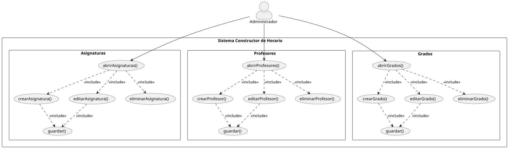

# Capítulo 3 – Disciplina de Requisitos

## 1. Introducción

El presente capítulo tiene como objetivo especificar los requisitos del sistema a través de la disciplina de casos de uso, formalizando las funcionalidades que el sistema ofrece desde el punto de vista del usuario y modelando el comportamiento del sistema ante los estímulos del entorno.

---

## 2. Casos de Uso

### Actor Principal

De acuerdo con el alcance definido, el sistema interactúa de forma centralizada con un único rol operativo:

- **Administrador:** Actor principal que posee el control total sobre la plataforma. Es el responsable de la gestión de los registros base (Asignaturas, Profesores, Grados y Aulas), de realizar las asignaciones cruzadas de recursos, de ejecutar el motor de generación horaria y de consultar la matriz resultante.

---

### Diagramas de Casos de Uso del Sistema

Para garantizar la legibilidad y evitar la saturación visual, la arquitectura funcional del **Sistema Constructor de Horarios** se ha dividido jerárquicamente en dos diagramas independientes. Ambos sitúan al actor Administrador en la parte superior, desencadenando los flujos principales hacia abajo, y organizan las operaciones secundarias.

#### Diagrama de Casos de Uso - Parte I: Gestión de Entidades Académicas
Este bloque agrupa los casos de uso encargados del mantenimiento de los registros fundamentales necesarios para la planificación.

#### Diagrama de Casos de Uso - Parte II: Infraestructura y Planificación
Este bloque modela la gestión de espacios físicos, el motor lógico de emparejamiento de recursos y el generador de horarios.

---

### Detallado de Responsabilidades de los Casos de Uso

En esta parte vamos a desglosar el protocolo de diálogo interactivo entre el **Administrador** y el **Sistema**, especificando los atributos y flujos de información de cada módulo.

#### Gestión de Entidades Académicas (Parte I)

| Caso de Uso Base | Caso de Uso Incluido | Atributos Involucrados | Responsabilidad del Protocolo de Diálogo |
| :--- | :--- | :--- | :--- |
| **abrirAsignaturas()** |  | *Lista de asignaturas* | El **Sistema** presenta la lista de asignaturas activas en pantalla mostrando su *Código*, nombre, créditos y curso. Permite filtrar la lista y acceder a las opciones de creación, edición o eliminación. |
| | `crearAsignatura()` / `editarAsignatura()` | *Código, Nombre, Créditos, Curso* | El **Sistema** despliega un formulario vacío o precargado. El **Administrador** interactúa modificando los campos y solicita guardar o cancelar la operación. |
| | `eliminarAsignatura()` | *Código, Nombre* | El **Administrador** selecciona un registro; el **Sistema** exige una confirmación expresa antes de purgar de forma permanente la asignatura. |
| | `guardar()` |  | El **Sistema** valida la integridad de los datos de la asignatura, persiste los cambios y refresca el listado general. |
| **abrirProfesores()** |  | *Lista de profesores* | El **Sistema** presenta el catálogo de docentes reflejando su *DNI*, nombre, apellidos, teléfono y correo electrónico. Ofrece herramientas de filtrado y acceso al CRUD. |
| | `crearProfesor()` / `editarProfesor()` | *DNI, Nombre, Apellidos, Teléfono, Correo* | El **Sistema** expone los campos requeridos para la ficha del docente. El **Administrador** valida que el *DNI* sea único al guardar los datos. |
| | `eliminarProfesor()` | *Nombre, Apellido* | Flujo de descarte de un docente del sistema mediante cuadro de diálogo interactivo de confirmación. |
| | `guardar()` |  | Validación, persistencia en la base de datos del profesor y retorno a la vista de lista limpia. |
| **abrirGrados()** |  | *Lista de grados* | El **Sistema** lista las titulaciones detallando su *Código* y su nombre |
| | `crearGrado()` / `editarGrado()` | *Código, Nombre* | Captura de los datos del plan de estudios del grado por parte del **Administrador** sobre la interfaz del formulario. |
| | `eliminarGrado()` | *Código*, *Nombre*| Evento de borrado lógico o físico del grado académico previa confirmación del usuario. |
| | `guardar()` |  | Almacenamiento definitivo de la estructura del grado en el repositorio del sistema. |

#### Infraestructura y Planificación (Parte II)

| Caso de Uso Base | Caso de Uso Incluido | Atributos Involucrados | Responsabilidad del Protocolo de Diálogo |
| :--- | :--- | :--- | :--- |
| **abrirAulas()** |  | *Lista de aulas* | El **Sistema** proyecta la infraestructura física mostrando *Código* y capacidad de aforo. |
| | `crearAula()` / `editarAula()` | *Código*, Capacidad, | El **Administrador** cumplimenta las especificaciones técnicas del espacio áulico sobre el formulario interactivo proporcionado. |
| | `eliminarAula()` | *Código* | El **Sistema** intercepta la orden de borrado de un aula para prevenir la destrucción accidental de recintos vinculados a horarios activos. |
| | `guardar()` |  | Confirmación, guardado físico del aula y actualización del inventario en pantalla. |
| **gestionarAsignaciones()** |  | Asignaturas pendientes | El **Sistema** presenta un panel lateral interactivo con las "tarjetas" de asignaturas que tienen profesor y aula asignada pero carecen de franja horaria. Funciona como el origen para la acción de arrastre. |
| | `asignarProfesorAsignatura()` | *Código* Asignatura, *DNI* Profesor | El **Sistema** despliega la lista disponible de docentes filtrada por sus DNI. El **Administrador** selecciona uno para vincularlo a la asignatura elegida. |
| | `asignarAulaAsignatura()` | *Código* Asignatura, *Código* Aula | El **Sistema** despliega las aulas del campus por su código. El **Administrador** realiza el emparejamiento con la asignatura para su futura sesión. |
| **generarHorario()** | `posicionarAsignatura()` | Matriz horaria, Sesión docente | El **Sistema** proporciona una cuadrícula visual (Días y Horas). El **Administrador** selecciona una asignatura del panel lateral, la **arrastra y la suelta** sobre una celda vacía. El **Sistema** valida instantáneamente que no existan colisiones de espacio o disponibilidad, confirmando el posicionamiento en tiempo real. |
| **consultarHorario()** |  | Cuadrícula Horaria | El **Sistema** dibuja la matriz final organizada. Permite al **Administrador** visualizar de forma estática la distribución y aplicar filtros rápidos de consulta por Aula o Profesor. |
| **iniciarSesion()** / **cerrarSesion()** |  | Credenciales de acceso | El **Sistema** restringe o concede el acceso a los módulos basándose en las credenciales del usuario, destruyendo el token de trabajo en el evento de cierre. |

---

### Diagrama de Contexto del Sistema (Navegación Global)

Para comprender cómo se integra el flujo de trabajo del **Administrador** con las diferentes funcionalidades, se presenta el **Diagrama de Contexto**. Este modelo no solo representa la arquitectura de estados del software, sino que define el marco de navegación global del sistema.

A través de este diagrama se observa cómo el sistema transita desde un estado de **Sesión Cerrada** hacia un **Sistema Disponible**, y cómo este "Contexto Principal" permite abrir y cerrar de forma controlada los diferentes módulos (Asignaturas, Profesores, Grados, Aulas y Horarios).

Este modelo es crítico para la funcionalidad de **Drag & Drop**, ya que garantiza que el sistema mantenga la integridad de los datos mientras el usuario transita entre la lista de "Asignaciones Pendientes" y la "Matriz de Horarios", asegurando que cada movimiento de arrastre se realice dentro de un contexto de sesión válido y persistente.

---

## 3. Priorización de Casos de Uso

En el marco de la metodología RUP, los casos de uso se priorizan atendiendo a tres criterios
principales: el **valor de negocio** que aportan al sistema, el **riesgo arquitectónico** que
implica su implementación y las **dependencias** con otros casos de uso. Esta priorización
orienta el orden de desarrollo en las iteraciones del proyecto.

### Criterios de valoración

| Criterio | Descripción |
|:---|:---|
| **Valor de negocio** | Impacto directo en la funcionalidad principal del sistema y en las necesidades del cliente. |
| **Riesgo arquitectónico** | Complejidad técnica que puede condicionar decisiones de diseño o revelar incertidumbres. |
| **Dependencia** | Otros casos de uso requieren que este esté implementado previamente. |

### Tabla de priorización

| Caso de Uso | Valor de Negocio | Riesgo Arquitectónico | Dependencias | Prioridad |
|:---|:---:|:---:|:---|:---:|
| `iniciarSesion()` / `cerrarSesion()` | Alto | Bajo | Ninguna — punto de entrada al sistema | **1** |
| `crearAsignatura()` / `editarAsignatura()` | Alto | Bajo | Requiere sesión activa | **2** |
| `crearProfesor()` / `editarProfesor()` | Alto | Bajo | Requiere sesión activa | **2** |
| `crearAula()` / `editarAula()` | Alto | Bajo | Requiere sesión activa | **2** |
| `crearGrado()` / `editarGrado()` | Alto | Bajo | Requiere sesión activa | **2** |
| `asignarProfesorAsignatura()` | Alto | Medio | Requiere profesores y asignaturas registradas | **3** |
| `asignarAulaAsignatura()` | Alto | Medio | Requiere aulas y asignaturas registradas | **3** |
| `generarHorario()` / `posicionarAsignatura()` | Crítico | Alto | Requiere asignaciones completas — núcleo del sistema | **4** |
| `consultarHorario()` | Alto | Bajo | Requiere horario generado | **5** |
| `eliminarAsignatura()` / `eliminarProfesor()` / `eliminarAula()` / `eliminarGrado()` | Medio | Bajo | Requiere registros existentes | **6** |

### Justificación del orden

- **Prioridad 1 — Gestión de sesión:** sin autenticación no es posible acceder a ningún módulo del
sistema, por lo que constituye el primer bloque a implementar.

- **Prioridad 2 — Gestión de entidades base:** las asignaturas, profesores, aulas y grados son los
datos fundamentales sobre los que opera toda la lógica de planificación. Sin ellos, ningún proceso
posterior puede ejecutarse.

- **Prioridad 3 — Asignaciones:** el emparejamiento de profesores y aulas con asignaturas es el
paso previo e imprescindible para poder construir un horario.

- **Prioridad 4 — Generación del horario:** constituye el núcleo funcional del sistema y su mayor
riesgo arquitectónico, al implicar validación de conflictos en tiempo real y la funcionalidad de
*drag & drop* sobre la matriz horaria.

- **Prioridad 5 — Consulta del horario:** funcionalidad de lectura que depende de que el horario
haya sido generado previamente.

- **Prioridad 6 — Eliminación de registros:** operaciones destructivas de menor criticidad para el
funcionamiento del sistema, implementadas una vez que el flujo principal está consolidado.

---

## 4. Conclusión del capítulo

La disciplina de requisitos formaliza las funcionalidades del sistema a través de los casos de uso,
estableciendo un acuerdo claro entre las necesidades del cliente y el comportamiento esperado del
sistema. La priorización de los casos de uso orienta el orden de desarrollo en las iteraciones
del proyecto, situando la generación del horario como núcleo funcional de mayor valor y riesgo
arquitectónico. El diagrama de contexto complementa esta visión definiendo el marco de navegación
global, base para el análisis y diseño del siguiente capítulo.
