# Diagramas — Capítulo 4: Análisis y Diseño

---

## Diagrama de Clases de Diseño

### v1

  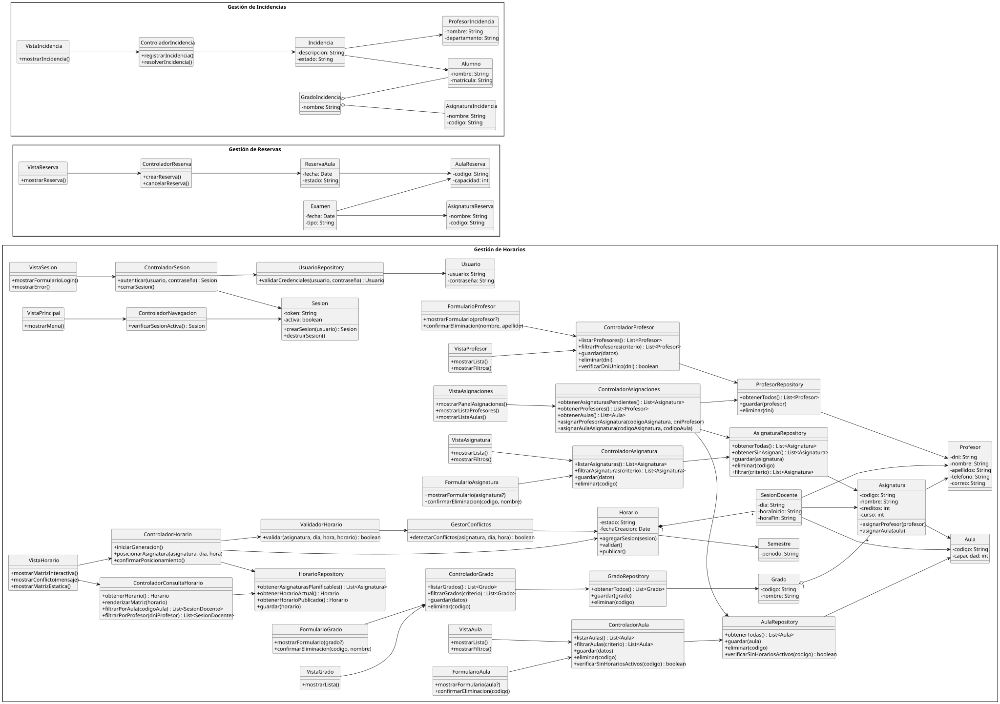

### v2 — Gestión de Horarios

  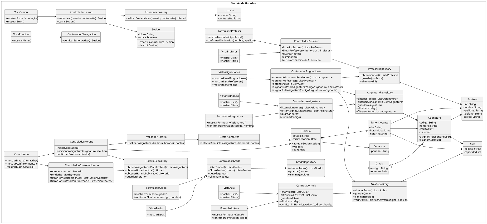

---

## Diagramas de Análisis MVC

Diagramas de colaboración Vista–Controlador–Modelo por caso de uso.

### Gestión de Sesión

#### analisisGestionSesion()

  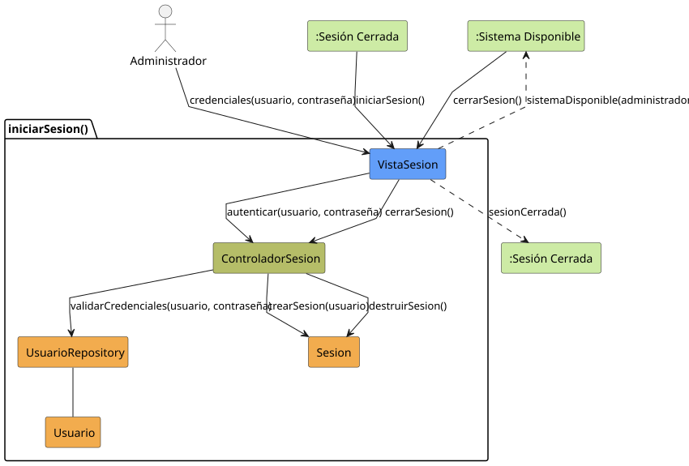

#### analisisCompletarGestion()

  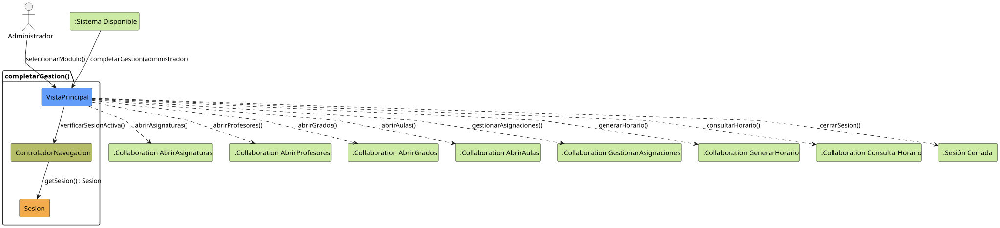

---

### Gestión de Asignaturas

#### analisisAbrirAsignaturas()

  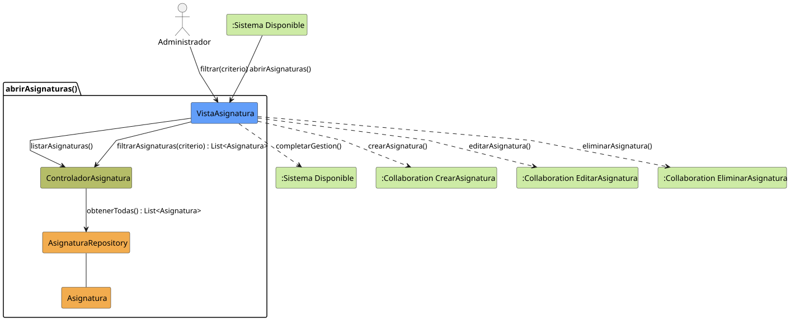

#### analisisAsignaturaFormulario()

  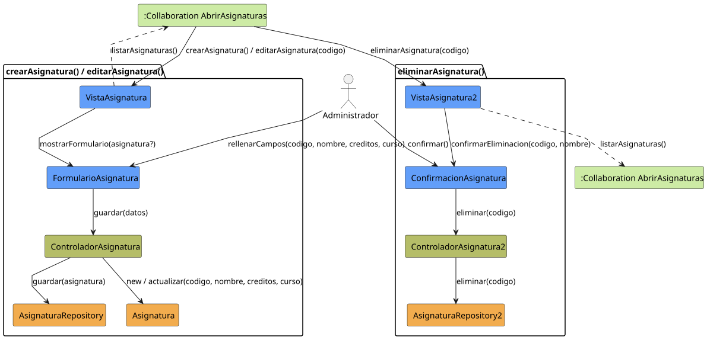

---

### Gestión de Profesores

#### analisisAbrirProfesores()

  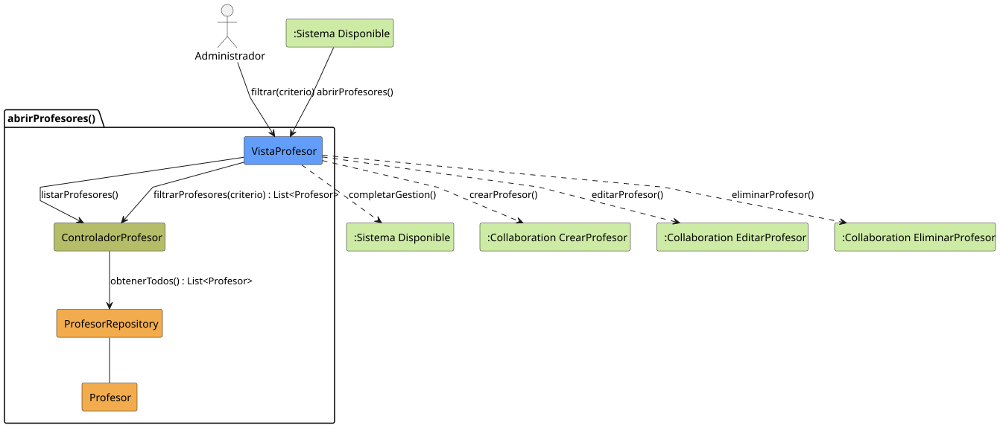

#### analisisProfesorFormulario()

  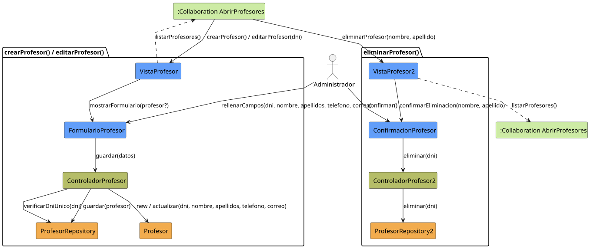

---

### Gestión de Grados

#### analisisAbrirGrados()

  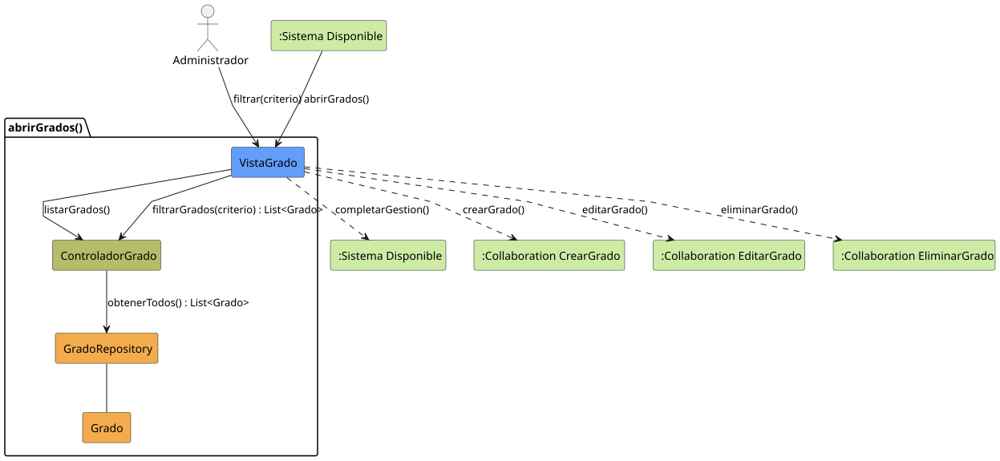

#### analisisGradoFormulario()

  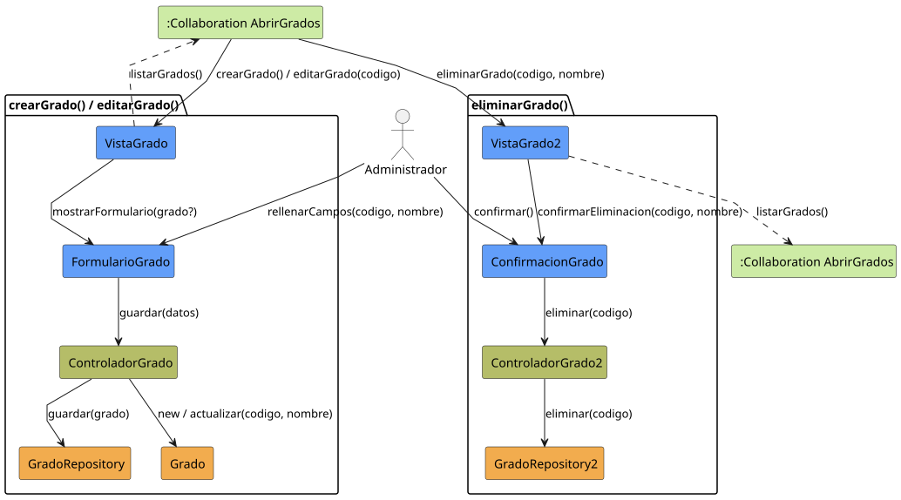

---

### Gestión de Aulas

#### analisisAbrirAulas()

  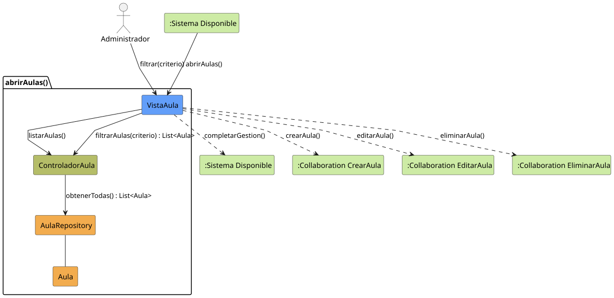

#### analisisAulaFormulario()

  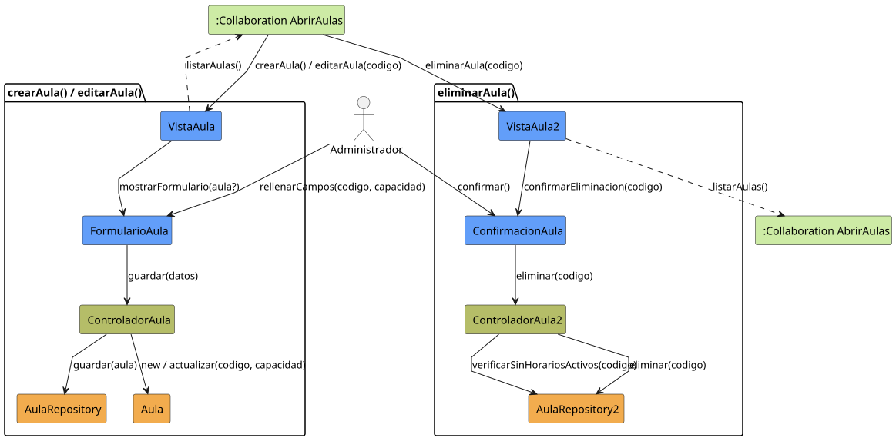

---

### Gestión de Asignaciones

#### analisisGestionarAsignaciones()

  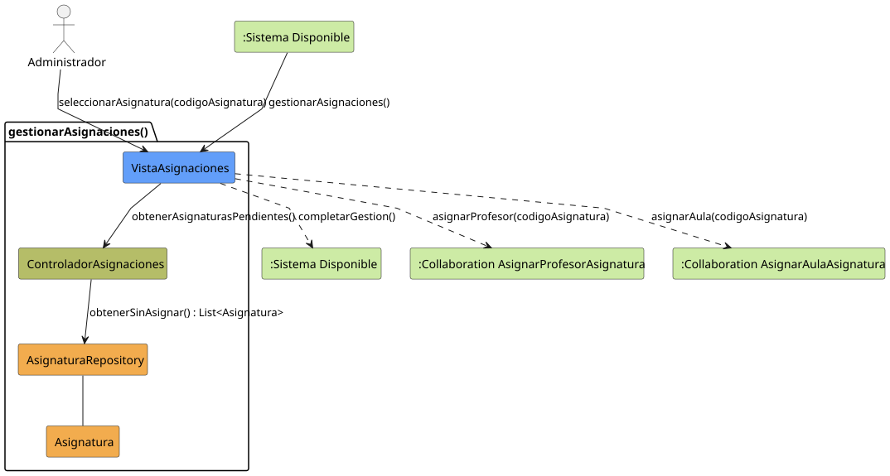

#### analisisAsignarProfesorAsignatura()

  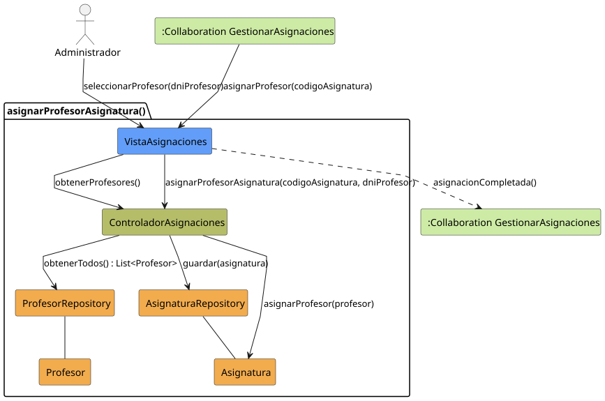

#### analisisAsignarAulaAsignatura()

  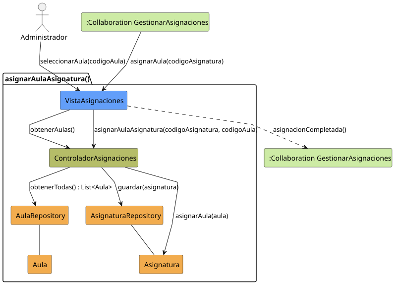

---

### Generación de Horario

#### analisisGenerarHorario()

  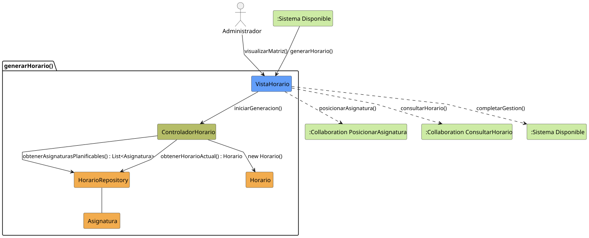

#### analisisPosicionarAsignatura()

  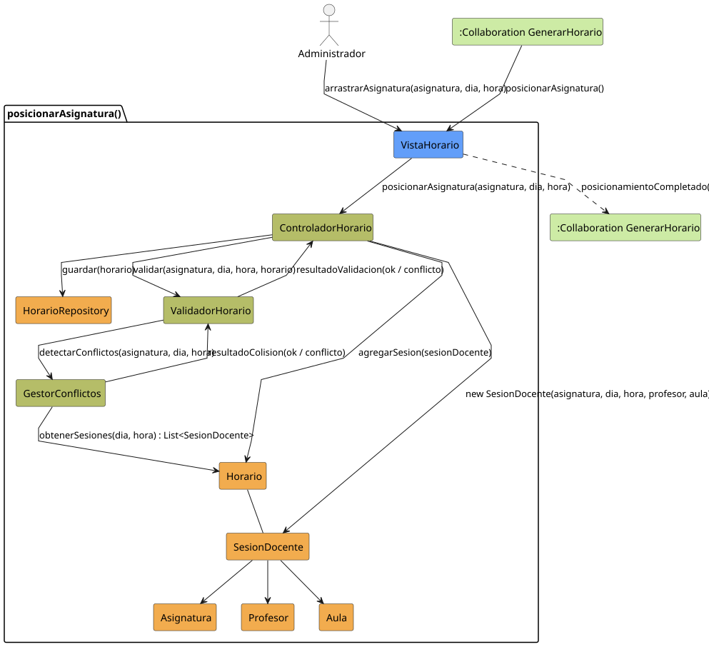

---

### Consulta de Horario

#### analisisConsultarHorario()

  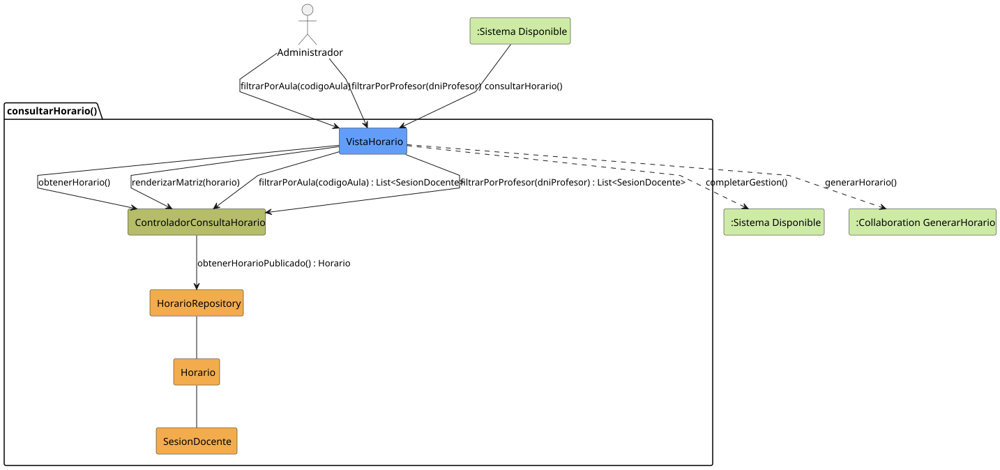

---

> Fuentes PlantUML en [`modelosUML/casosDeUso/analisis/`](./modelosUML/casosDeUso/analisis/) y [`modelosUML/diagramaDiseño/`](./modelosUML/diagramaDiseño/)
