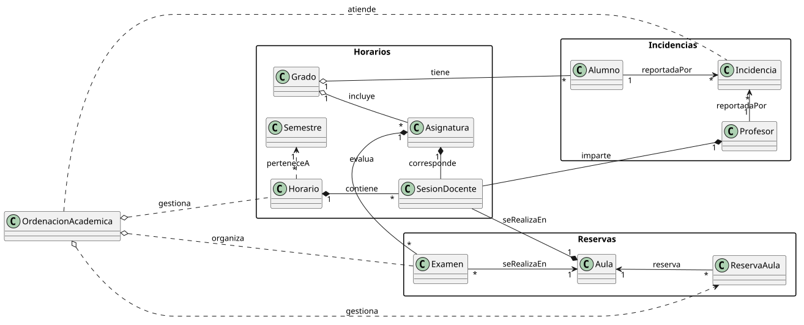
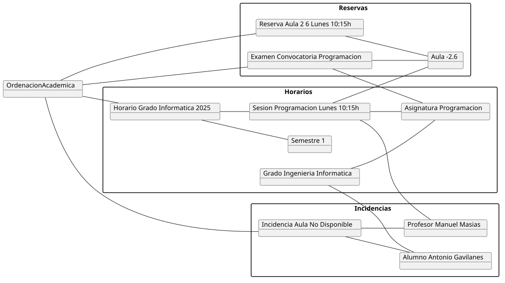
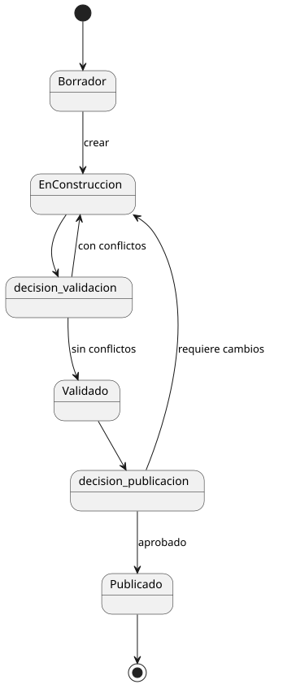
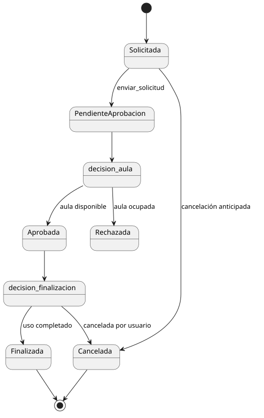

# Diagramas — Capítulo 2: Modelo del Dominio

---

## Modelo del Dominio

  

---

## Diagrama de Objetos

  

---

## Diagramas de Estados

### Horario

  

### Incidencias

  

### Reservas de Aula

  

---

> Fuentes PlantUML en [`modelosUML/`](./modelosUML/)
