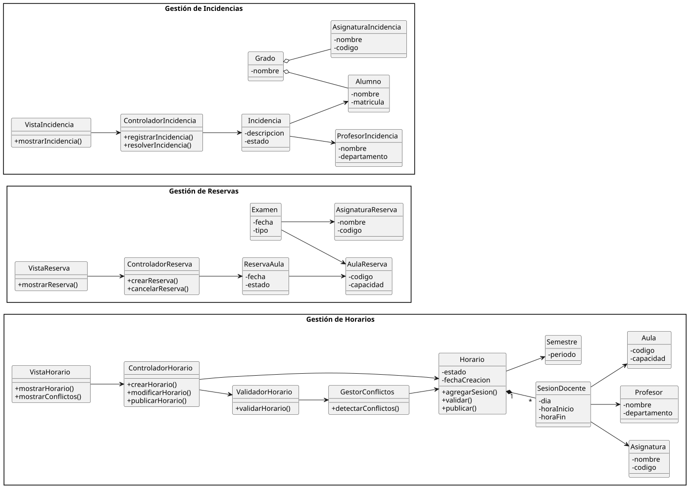
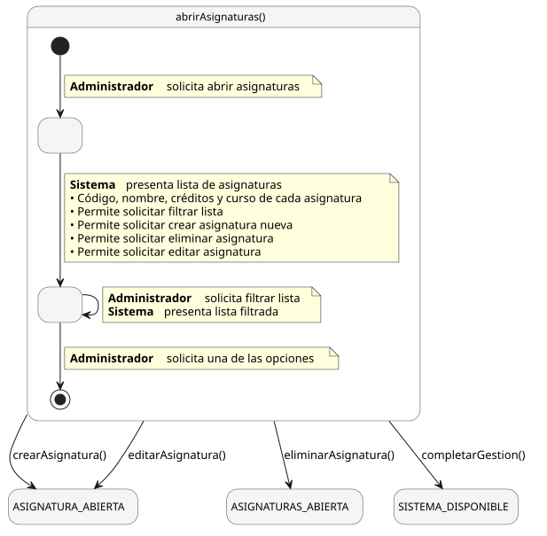
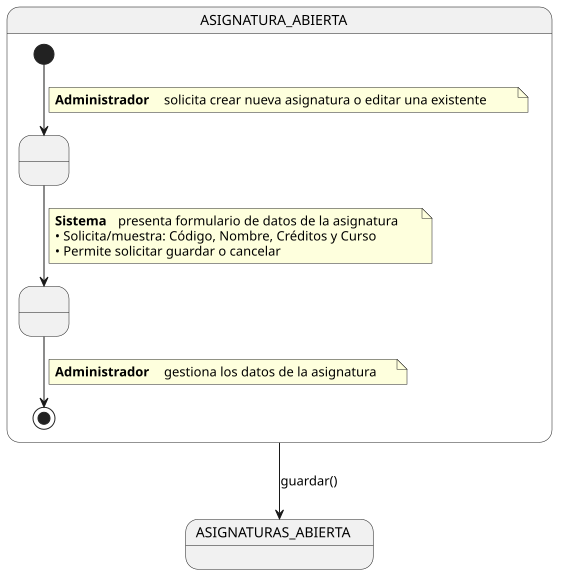
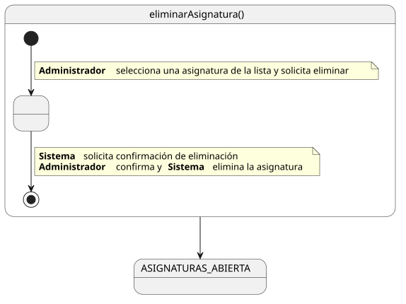

# Diagramas

---

## Modelo del Dominio

  

---

## Diagrama de Objetos

  

---

## Diagramas de Estados

### Horario

  

### Incidencias

  

### Reservas de Aula

  

---

## Casos de Uso

### Parte I — Gestión de Entidades Académicas

  

### Parte II — Infraestructura y Planificación

  

---

## Diagrama de Contexto

  

---

## Diagrama de Diseño

  

---

## Detallado de Casos de Uso

### abrirAsignaturas()

  

### crearAsignatura() / editarAsignatura()

  

### eliminarAsignatura()

  

---

> Los fuentes PlantUML de todos los diagramas se encuentran en [`modelosUML/`](./modelosUML/)
