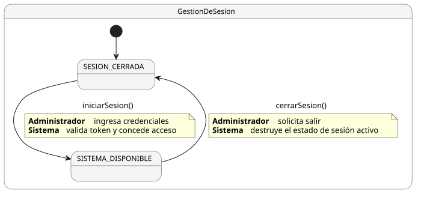
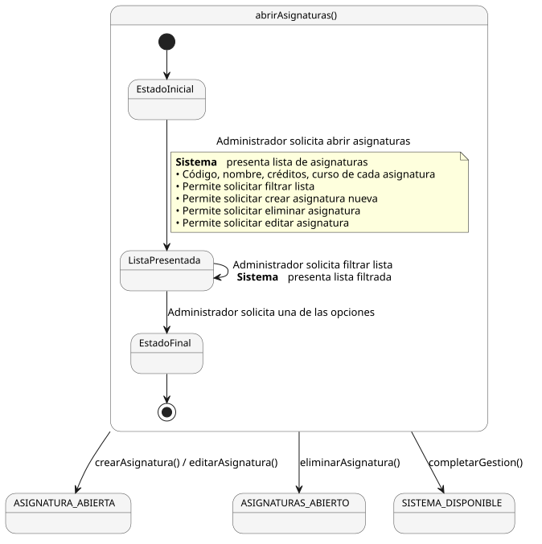
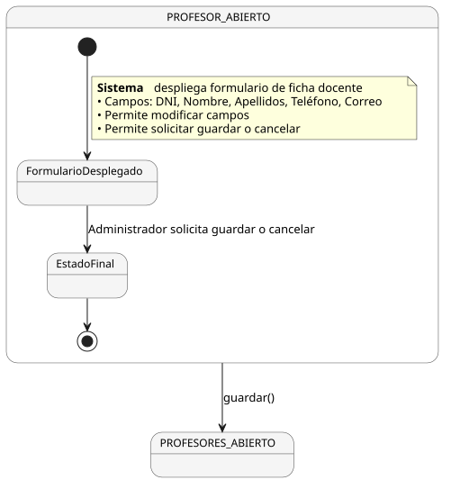
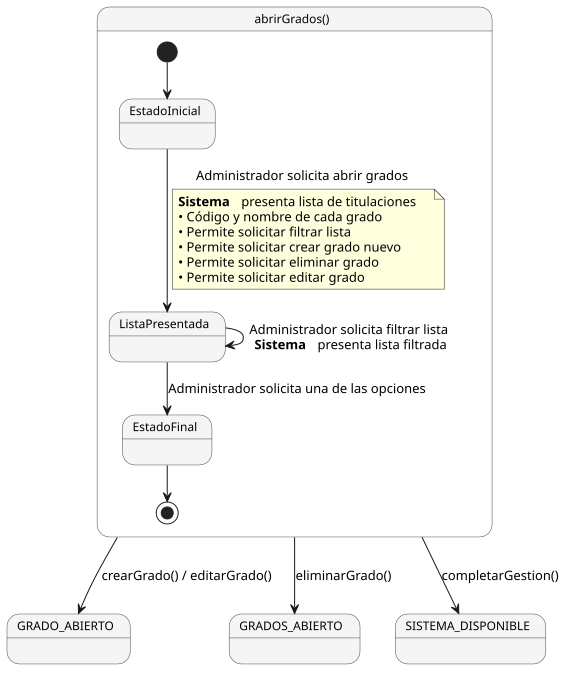
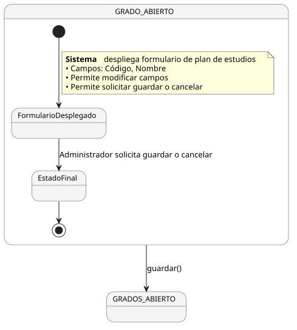
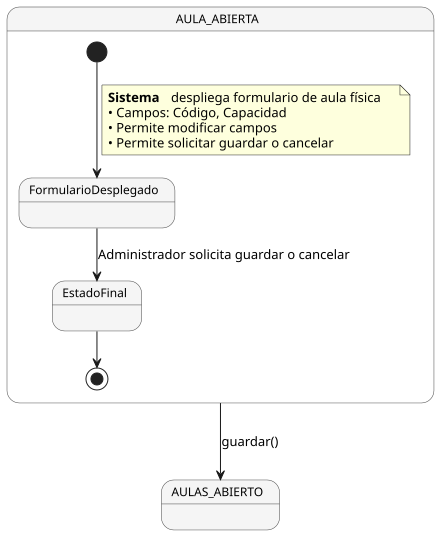
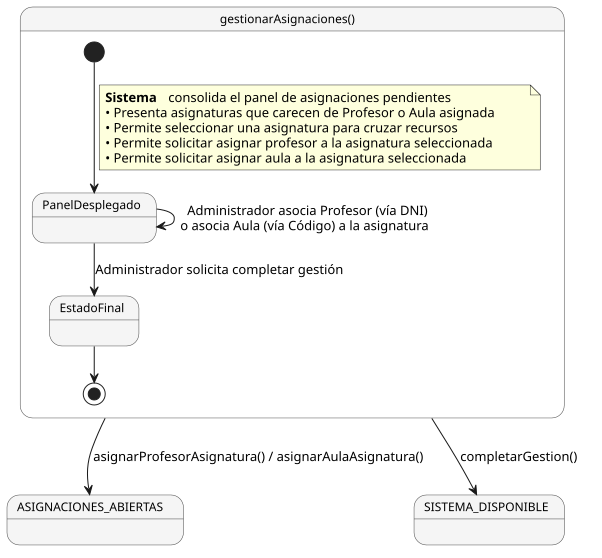
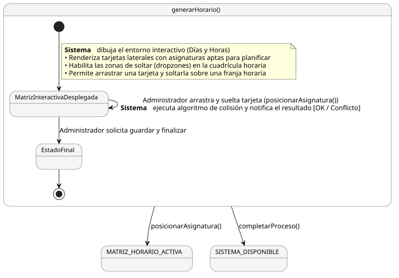
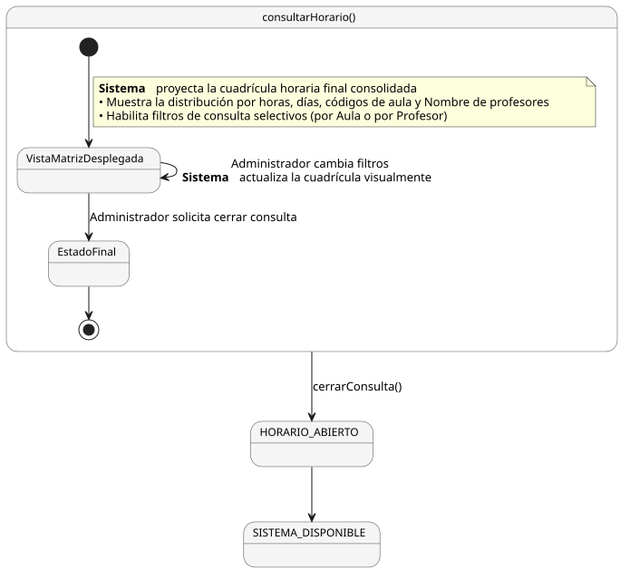

# Diagramas — Capítulo 3: Disciplina de Requisitos

---

## Casos de Uso

### Parte I — Gestión de Entidades Académicas

  

### Parte II — Infraestructura y Planificación

  

---

## Diagrama de Contexto

  

---

## Detallado de Casos de Uso

### Gestión de Sesión

#### gestionSesion()

  

---

### Gestión de Asignaturas

#### abrirAsignaturas()

  

#### asignaturaFormulario()

  

---

### Gestión de Profesores

#### abrirProfesores()

  

#### profesorFormulario()

  

---

### Gestión de Grados

#### abrirGrados()

  

#### gradoFormulario()

  

---

### Gestión de Aulas

#### abrirAulas()

  

#### aulaFormulario()

  

---

### Planificación

#### gestionarAsignaciones()

  

#### generarHorario()

  

#### consultarHorario()

  

---

> Fuentes PlantUML en [`modelosUML/`](./modelosUML/)
